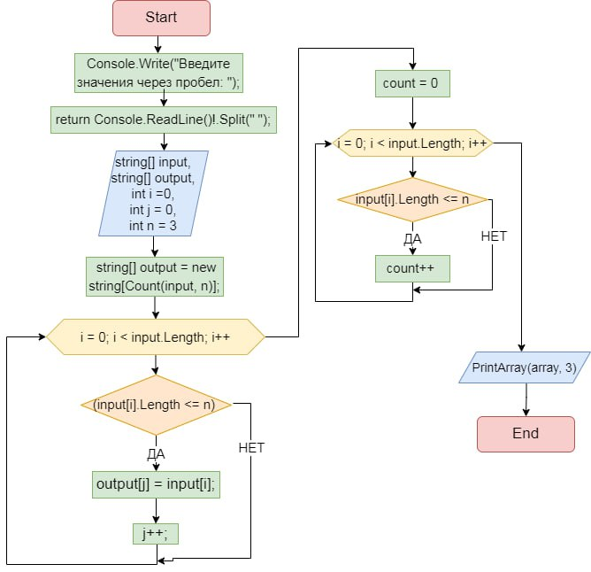

Решения:
---
* Перебираем элементы в заданном массиве.  
*  Поочерёдно идет проверка каждого элемента в массиве на соответствие заданному условию, длина строки меньше либо равна 3 символа.
* Если строка удовлетворяет условию кладем значение в новый массив.
* Пока не достигнем конца исходного массива будем повторять пункты 2 и 3. 
* Возвращаем новый заполненный в соответствие заданному условию массив как результат..
  
